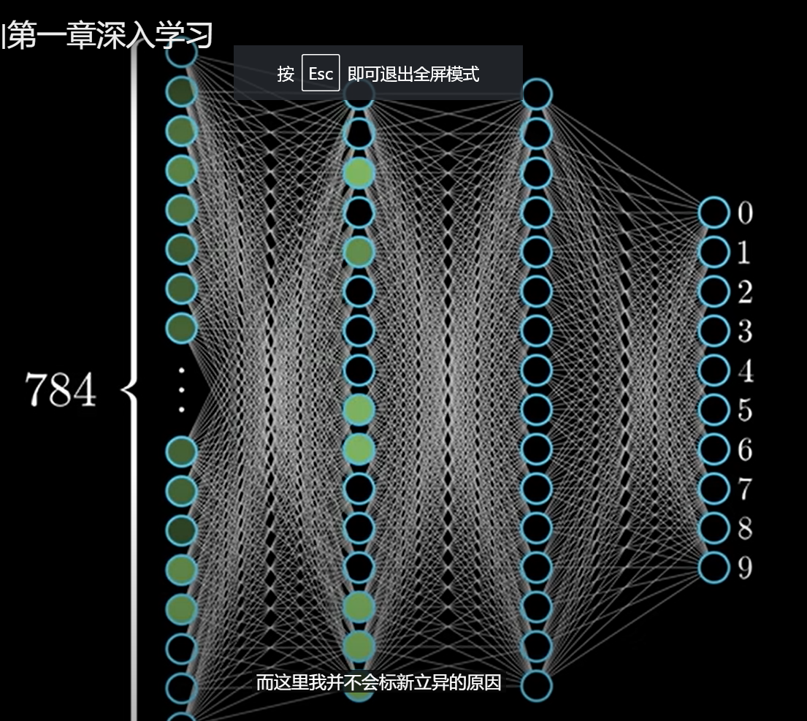
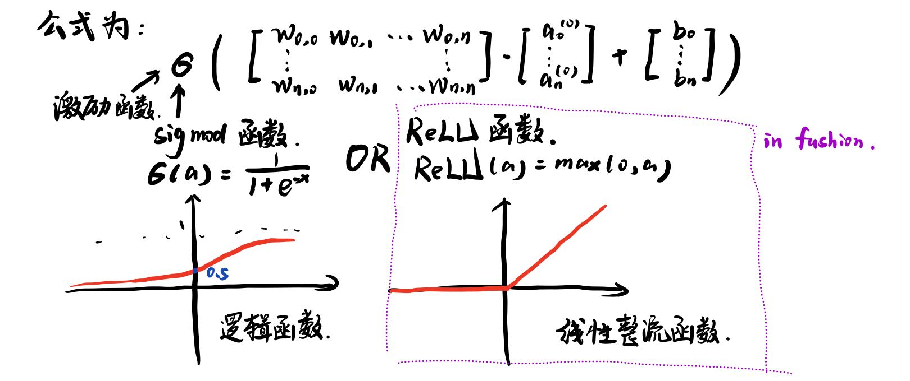
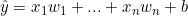
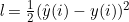
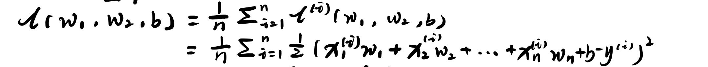
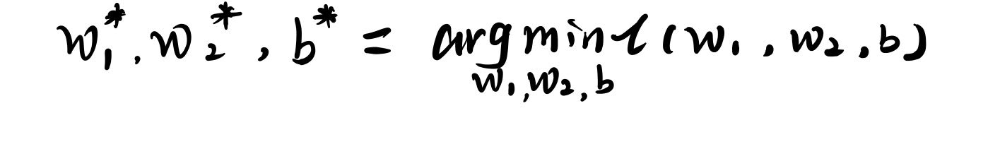
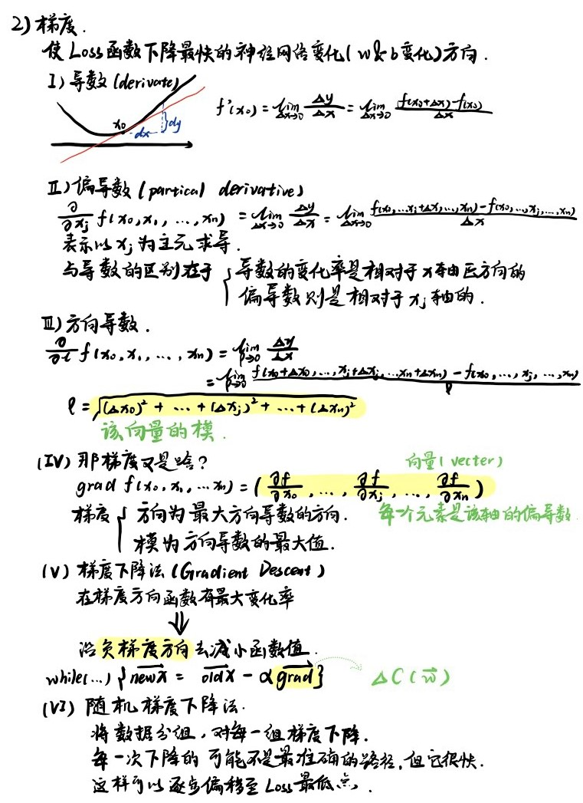

# DeepLearning

## 基本框架

> 整个神经网络就是一个函数

每一个点都是一个神经元，每一个神经元的每一次传导都有自己的权重(weight)和偏置(bias)，最后乘上激活函数(activation function)来模拟生物神经元的激活

## 梯度:下山最快的方向

>Question:应该如何调整weight和bias才能最快减少网络判断结果和真实结果之间的差距？

先引入几个概念

### Loss函数

对最后判定的值而言，它与真实值y有一定差距
为表达误差,我们定义Loss函数:,亦称为平方损失(square loss)
整个Loss函数为:

而使该Loss函数最小的参数记为:

### 梯度到底是啥?

>definition:梯度的本意是一个向量（矢量），表示某一函数在该点处的方向导数沿着该方向取得最大值，即函数在该点处沿着该方向（此梯度的方向）变化最快，变化率最大（为该梯度的模）。

>梯度下降法（英语：Gradient descent）是一个一阶最优化算法，通常也称为最陡下降法，但是不该与近似积分的最陡下降法（英语：Method of steepest descent）混淆。 要使用梯度下降法找到一个函数的局部极小值，必须向函数上当前点对应梯度（或者是近似梯度）的反方向的规定步长距离点进行迭代搜索。如果相反地向梯度正方向迭代进行搜索，则会接近函数的局部极大值点；这个过程则被称为梯度上升法。

**因此每一次梯度下降就好像下山(降低Loss),等到达山谷的最低处(Loss的最低处)就达到了训练的目的**
