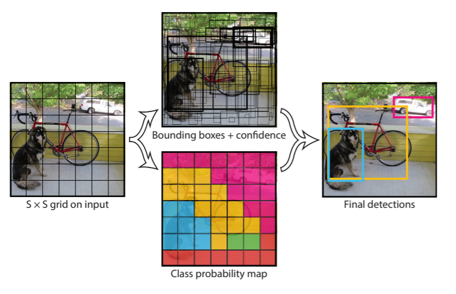
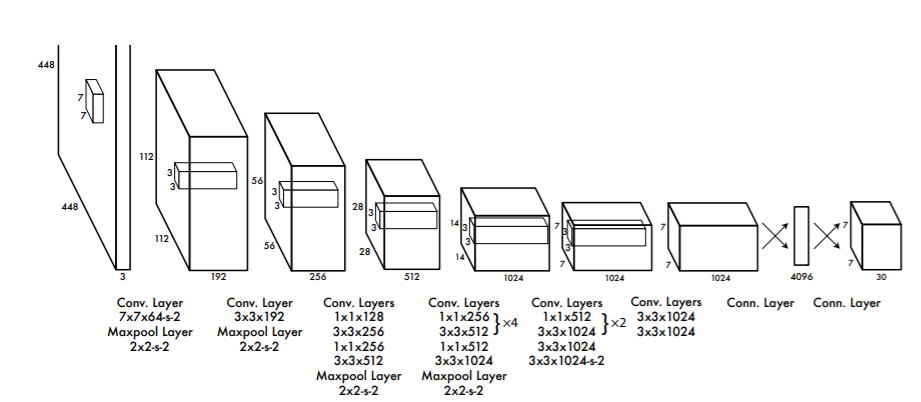
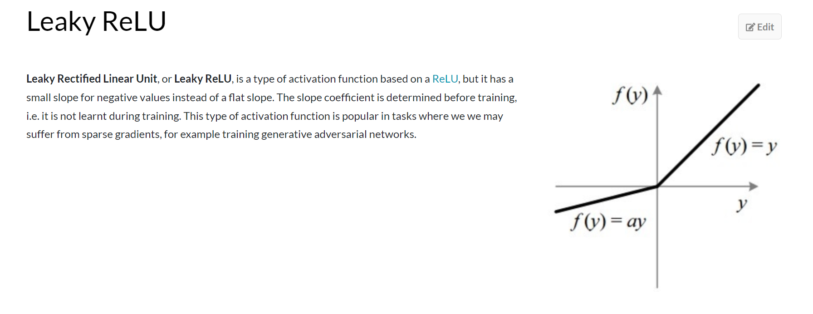
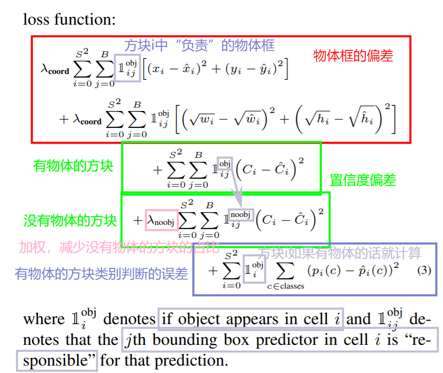
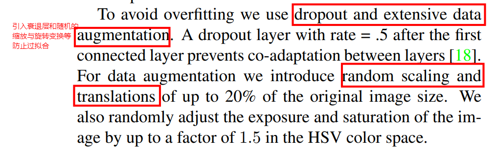

# YOLOv1

## 介绍

> You Only Look Once:Unified, Real-Time Object Detectio

yolo 是统一、单阶段的，快速、即时的目标检测模型

相较于其他的模型（例如 CNN）

- 它的最大特点是快
- 同时是“全局性”（globally）检测，更有整体观
- 能够提取出物体的抽象特征，便于迁移到艺术品等的检测

## 检测原理

yolo 将整个图片分成 S\*S 个格子（grid），然后对其分别做两个检测

- 物体框（bounding box），包括五个维度：x,y(中心点坐标),w,h(宽和长),C(置信度)
  - 其中的置信度指的是这个框内存在物体的概率的可信度，用存在物体的概率乘以 IOU（预测事实与真正事实的交集除以预测事实与真正事实的并集）
- 类别检测（conditional class），每一个小方块预测一个类别，表示这个小方块内的物体框如果有物体那这个物体的类别是什么

因此，某方块内存在某类别的物体的置信度是：

yolo 输入张量的维度为 S\*S\*(B\*5+c)，在 yolov1 中 B 往往是 1

**所以，yolo 的基本思想是：在这个区域有物体，而且这个物体是这个类别的，所以在这个区域有这个类别的物体**

## 神经网络设计

**yolov1 的主体是卷积神经网络，模型大小取决于卷积神经网络的层次**

**对原图多次卷积、池化（最大池化）后接两个全连接层**

通过卷积提取出原图的多个局部特征，通过池化降噪，然后经过全连接层整合特征并引入非线性后得到结果

## 训练

### 激活函数

采用 leakyReLU 函数

### loss 函数

### 过拟合处理

